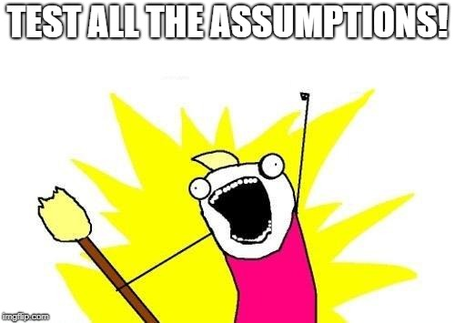

## Outline

- Biostatistics competencies (everyone)
- Epi-bio concentrator competencies

{width=400px}

## Biostatistics competencies (everyone)

*	Analyze quantitative data using biostatistics, informatics, computer-based programming and software, **as appropriate**.
    + Translation: Select and compute the appropriate statistics for different situations
*	Interpret results of data analysis for public health research, policy or practice.

## Competency 1

Analyze quantitative data using biostatistics, informatics, computer-based programming and software, as appropriate.

## Situation 1: Descriptive statistics for a single continuous variable 

* Know which measure of central tendency to use and what it means
    + Mean
    + Median 
* Know which measure of spread goes with each central tendency and what it shows
    + Standard deviation
    + Standard error
    + Range
    + Interquartile range or IQR 

## Situation 2: Descriptive statistics for a single categorical variable

* Frequencies 
* Percents 
* Mode (rarely used)

## Situation 3: Inferential statistics for a single continuous variable

* Compare a score of one observation to the rest of a sample
    + z-score
* Compare the central tendency of a group to a hypothesized or population value
    + one-sample t-test
    + sign test

## Situation 4: Inferential statistics for two categorical or continuous variables

* Association between two categorical variables
    + chi-squared
    + odds ratio and confidence interval
* Association between two continuous variables
    + correlation coefficient
    + Spearman's rho
    
    

{width=500px}

## Situation 5: Inferential statistics for one categorical and one continuous variable

* Compare central tendency across two groups 
    + independent samples t-test
    + Mann-Whitney U test
* Compare central tendency across more than two groups 
    + ANOVA
    + Kruskal-Wallis

## Situation 6: Multivariate inferential statistics 

* Predict or explain a continuous outcome
    + Linear regression
* Predict or explain a binary outcome
    + Logistic regression
    
## Know what to report for univariate and bivariate inferential statistics

* Univariate tests
    + Test statistic (t, z), p-value
    + Appropriate descriptive statistics to provide context (mean, sd, median, range)
* Bivariate tests (chi-squared, t-test, U, etc)
    + Test statistic, df, p-value
    + Means and standard deviations, medians and ranges, or percentages across groups

## Know what to report for multivariate

* Reporting logistic
    + Model significance (chi-squared with df and p-value)
    + Model fit (% correctly predicted or pseudo R-squared)
    + Predictor direction, magnitude, significance (OR & CI)
* Reporting linear
    + Model significance (F with df and p-value)
    + Model fit (R-squared)
    + Predictor direction, magnitude, significance (b & p)

## Competency 2 

Interpret results of data analysis for public health research, policy or practice.

## Interpret the results of each test above 

* Review how to interpret the values reported with each test 
    + test statistics 
    + p-values 
    + model fit 
    + other values (e.g., descriptive statistics, odds ratios)

{width=500px}

## Interpret tables and graphs

* Be able to find and interpret statistics in tables in reports and published papers
    + Know the difference between a row percent and a column percent!
* Be able to read typical types of graphs
    + bar graph (including grouped and stacked bar graphs) 
    + scatterplot 
    + histogram 
    + line graph
    

{width=600px}

## Create tables and graphs 

* Use appropriate graphs given the data type(s) (e.g., scatterplot is for two continuous variables)
* Create tables and graphs using clear and complete formatting, for example:
    + Use labels that everyone can understand (YES: Smoking status, NO: var105b_ss) 
    + Include a descriptive title (YES: Characteristics of 500 students surveyed about health behavior in 2018., NO: Descriptive statistics for the sample.)
    + Include labels on both axes
* Avoid formatting that can be misleading such as starting an axis at a high number to make a difference appear bigger

{width=500px}

    
## Biostat competencies (Specializers only)

* Describe preferred methodological alternatives to commonly used statistical methods when assumptions are not met. 
* Apply and interpret common statistical methods for inference (e.g., ANOVA, linear and logistic regression, survival analysis) found in public health studies.
* Describe principles and the application of key concepts from probability and inference to colleagues without extensive statistical training. 

{width=500px}

## Translation...deeper knowledge about all tests above and those in ADA, including:

* Assumption checking
    + Assumptions required for each test
    + How to check assumptions
    + What to do when any given assumption is not met 
* Use and interpret appropriate follow-up tests
    + Standardized residuals 
    + Post-hoc tests 
    

{width=500px}

## The bottom line

* Biostat concepts on the exam are the topics covered in your biostat courses
* Review your notes and assignments from Foundations of Biostatistics and ALM (and ADA for concentrators)
* Practice conducting and interpreting the statistical tests listed above and any others covered in your classes
* Practice stating your interpretations so they are clear to lay audiences
* Practice finding and interpreting information in tables and graphs in reports and published research 
* Review creating your own tables and graphs
* Formulas will be provided so focus on selecting, reporting, and interpreting statistics (not memorizing formulas)

